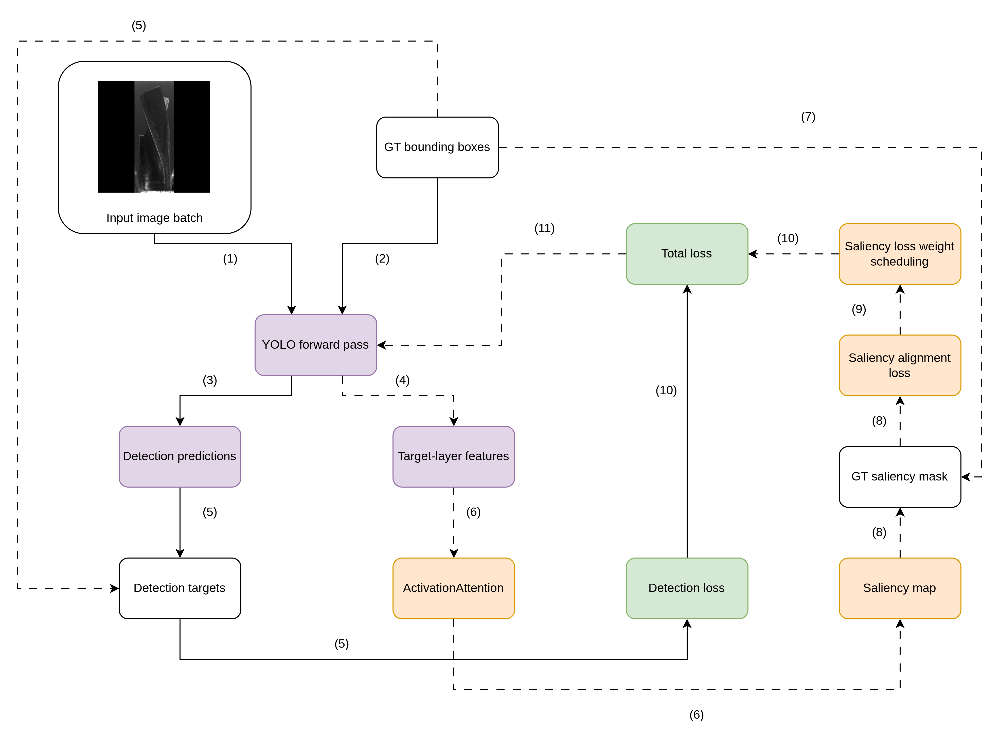

# XAI-Driven Saliency Loss for Industrial Drill-Bit Defect Detection

This repository presents an XAI-guided training framework for defect detection in industrial drill-bit images.  
The central idea is to move explainability from post-hoc analysis into the training objective itself by combining standard YOLO detection loss with a saliency alignment loss.

Instead of asking only whether the detector predicts the correct class and bounding box, the method also encourages the model to focus its internal attention on the true defect region.

## Motivation

Detecting drill-bit defects is challenging because:

- defects are often small relative to the image,
- grayscale metal textures create confusing background patterns,
- several defect types have similar local appearance,
- a detector can achieve acceptable metrics while still relying on spurious cues.

For that reason, this project studies whether saliency-guided optimization can improve both detection quality and the spatial plausibility of the learned representation.

## Proposed Method

The framework extends standard YOLO training with:

1. a target-layer activation extractor,
2. a differentiable saliency generator based on `ActivationAttention`,
3. a ground-truth saliency mask derived from bounding boxes,
4. a saliency alignment term added to the detector objective.

The total objective is:

\[
L_{\text{total}} = L_{\text{det}} + \lambda_{\text{sal}} L_{\text{sal}}
\]

where `L_det` is the original detection loss and `L_sal` penalizes attention that falls outside the defect region.

## Training Pipeline



The training flow is:

- input images and ground-truth boxes enter the YOLO forward pass,
- the detector produces predictions and intermediate target-layer features,
- `ActivationAttention` converts those features into a saliency map,
- bounding boxes are converted into a ground-truth saliency mask,
- detection loss and saliency alignment loss are combined into a total loss,
- a saliency-weight schedule controls the influence of the XAI branch during training.

## What Is Included in This GitHub Version

This GitHub version is organized around two public folders:

```text
.
├── src/
│   ├── losses/                      # Saliency alignment loss
│   ├── masks/                       # Ground-truth saliency mask utilities
│   ├── metrics/                     # Saliency and evaluation metrics
│   ├── notebooks/                   # EDA, training, and comparison notebooks
│   ├── training/                    # XAI-guided training logic and adapters
│   └── xai/                         # ActivationAttention and XAI helpers
└── output/
    ├── EDA/                         # Dataset exploration figures
    ├── baseline_v2_fixed_control/   # Baseline detector outputs
    ├── xai_from_scratch_v2_fixed/   # XAI-guided detector outputs
    └── compare_xai_vs_baseline_v2_fixed/
                                     # Report-ready comparison figures
```

## Key Folders

### `src/`

Contains the implementation of the XAI-guided training framework:

- `src/xai/`: saliency and activation-based explanation modules
- `src/masks/`: utilities for converting bounding boxes into supervision masks
- `src/losses/`: saliency alignment loss
- `src/training/`: training logic for combining detection loss and saliency loss
- `src/metrics/`: saliency-oriented evaluation metrics
- `src/notebooks/`: experiment, EDA, and comparison notebooks

### `output/`

Contains experiment artifacts and figures used for analysis:

- `output/EDA/`: exploratory data analysis plots
- `output/baseline_v2_fixed_control/`: baseline YOLO outputs
- `output/xai_from_scratch_v2_fixed/`: XAI-guided training outputs
- `output/compare_xai_vs_baseline_v2_fixed/figures/`: comparison plots ready to use in a report

## Main Experimental Focus

The current experiments compare:

- a baseline YOLO detector,
- an XAI-guided detector trained with saliency supervision,
- validation performance using Precision, Recall, `mAP50`, and `mAP50-95`,
- additional saliency diagnostics such as energy inside the defect region and pointing-style behavior.

## Recommended Starting Points

If you want to inspect the project quickly, start with:

- `src/notebooks/compare_xai_vs_baseline_v2_fixed.ipynb`
- `output/compare_xai_vs_baseline_v2_fixed/figures/`
- `output/EDA/`
- `output/baseline_v2_fixed_control/`
- `output/xai_from_scratch_v2_fixed/`

## Summary

This repository is intended to document and analyze a practical research direction:

**Can a detector be trained not only to predict correctly, but also to attend to the right visual evidence?**

The code under `src/` and the experiment outputs under `output/` are the main public materials provided to support that question.
